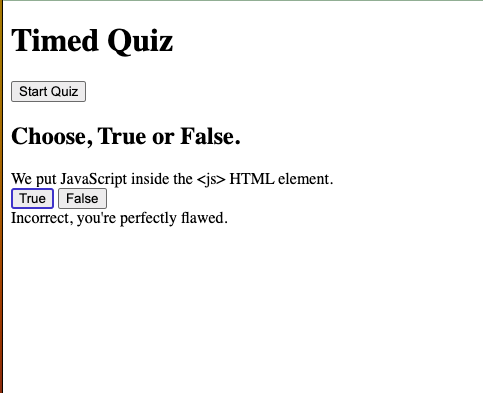

# True/False Timed Quiz App

This is a True/False Timed Quiz App where players answer a series of questions within a 60-second time limit. The app awards points for correctly answered questions, deducts points for wrong answers, and subtracts fifteen seconds from the timer for wrong answers as well. Once the timer runs out or all the questions are answered, the game is over, and the player's score is rendered and added to a saved scores list along with their initials.

## Features

- True/False questions: The app presents a series of True/False questions to the player.
- Timer: A 60-second timer starts as soon as the quiz begins. The timer is displayed to the player, and it counts down until it reaches zero.
- Scoring system: Correctly answered questions are awarded 1 point. Wrong answers deduct 1 point from the score and subtract fifteen seconds from the timer.
- Game Over: The game ends when either the timer runs out or all the questions are answered.
- Score rendering: Once the game is over, the player's score is rendered and displayed to them.
- Saved scores list: The player's score, along with their initials, is added to a saved scores list.
- User interface: The app provides a user-friendly interface for answering questions, displaying the timer, and showing the current score.

## Technologies Used

The True/False Timed Quiz App is built using the following technologies:

- HTML: For structuring the quiz layout and user interface.
- CSS: For styling the quiz app to enhance the visual experience.
- JavaScript: For implementing the quiz logic, timer functionality, scoring system, and handling user interactions.
- Local Storage: To store and retrieve the saved scores list.

## Usage

To use the True/False Timed Quiz App, follow these steps:

1. Clone the repository or download the source code.
2. Open the `index.html` file in a web browser.
3. The quiz will start automatically, and the timer will begin counting down from 60 seconds.
4. Read each question and select either the True or False button to answer.
5. The app will instantly provide feedback on whether the answer is correct or wrong.
6. For wrong answers, 1 point will be deducted from the score, and fifteen seconds will be subtracted from the timer.
7. Continue answering the questions until the timer runs out or all the questions are answered.
8. Once the game is over, the final score will be displayed on the screen.
9. The player can enter their initials in a form provided and click a "Submit" button to save their score.
10. The saved score will be added to the list of scores, which can be viewed in a separate section.

## License

This project is licensed under the [MIT License](https://opensource.org/licenses/MIT).

## deployment

<https://anthony-a-perez.github.io/wordGuessGame/>

## repository

<https://github.com/Anthony-A-Perez/wordGuessGame>

